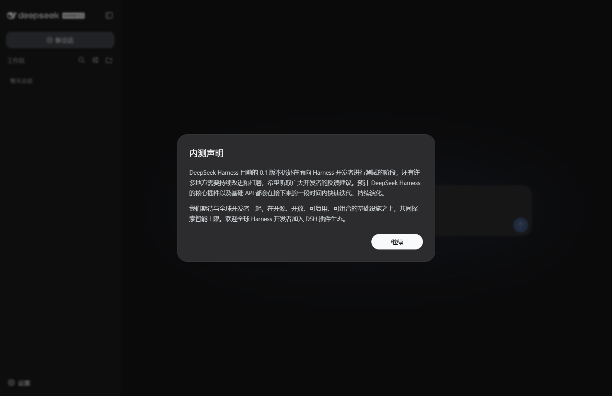
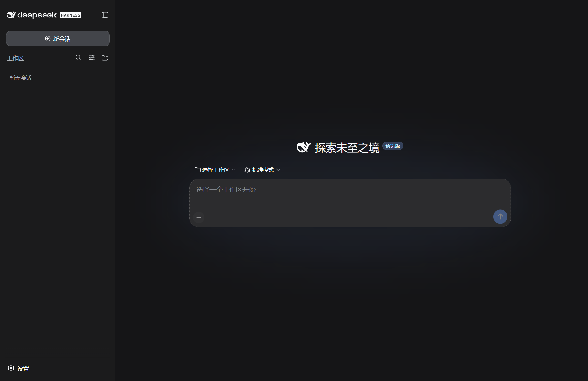
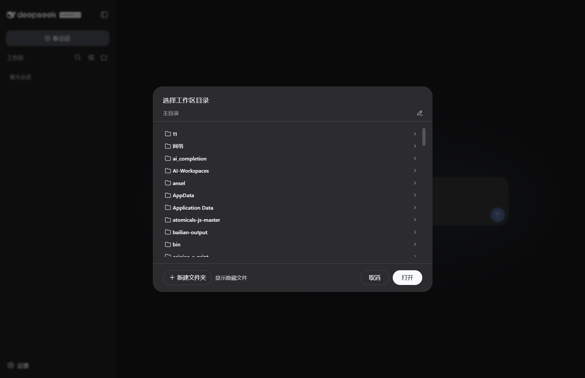
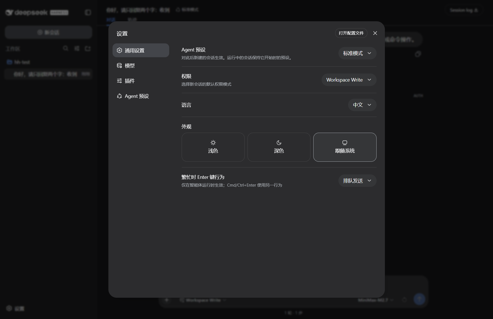
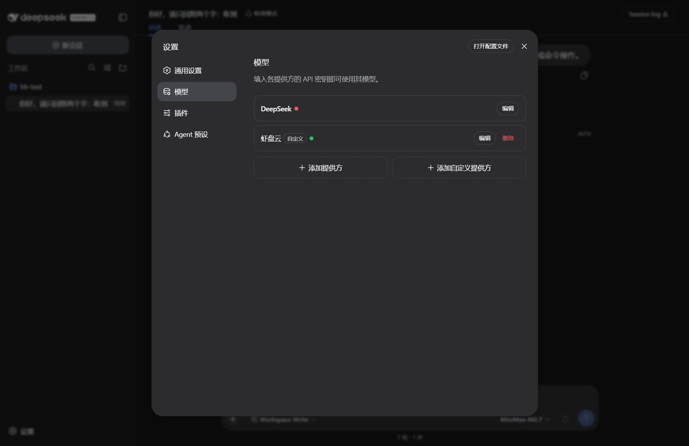
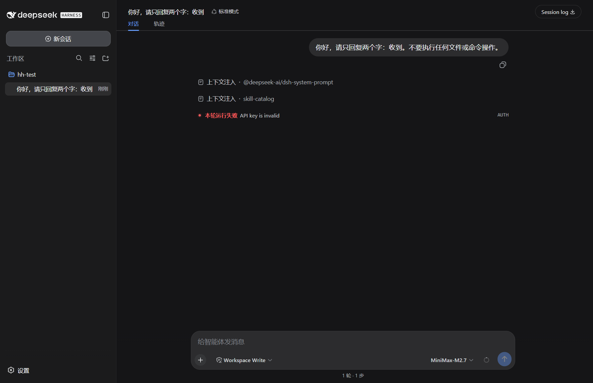

# U-DSH Portable 新手教程：插上 U 盘就能聊 DeepSeek

## 这是啥？能干嘛？

一句话：**一个塞在 U 盘里的 AI 聊天工具**，给不想折腾的人用的。

它把 DeepSeek 的对话程序整个打包好了：不用装 Node.js、不用装任何「环境」、不用敲命令。插到任何一台 Windows 电脑上，双击就能开聊。而且**打开就自带额度，不用注册、不用申请 API Key、不用先充值**——这是它和别的同类最大的区别。

> 它跟 DeepSeek 官方没关系，是社区做的开源软件（MIT 协议），代码全公开。

## 第一步：下载

1. 打开下载页：https://github.com/dongsheng123132/u-dsh-deepseek-harness-portable/releases/latest
2. 找文件名里带 **Windows-x64** 的那个版本（当前是 `U-DSH-DeepSeek-Harness-Portable-0.2.0-Windows-x64.exe`，142MB），点下载。
   它只支持 64 位 Windows，Mac 和 Linux 用不了。

## 第二步：检查 U 盘格式（必须 NTFS）

U-DSH 对 U 盘有一个硬性要求：**必须是 NTFS 格式**，不对的话程序会直接提示你，用不了。

怎么看 U 盘是什么格式：

- 打开「此电脑」→ 右键点 U 盘 → 「属性」→ 看「文件系统」那一行；
- 或者：开始菜单搜 PowerShell 打开，输入 `Get-Volume` 回车，看 U 盘对应的 FileSystem 一列。

**如果显示的是 exFAT 或 FAT32：**

1. **先把 U 盘里所有文件备份到电脑上**——下一步会全部清空！
2. 右键 U 盘 → 「格式化」→ 「文件系统」选 **NTFS** → 「开始」。
3. 格式化完，再继续往下走。

> 为什么必须 NTFS？程序启动时要在 U 盘上建一个「目录链接」，只有 NTFS 放得下这种链接，exFAT/FAT32 不行。

## 第三步：解压（要等几分钟，别中途关掉！）

1. 双击刚下载的 `.exe` 文件。
2. 弹出确认框，点「确定 / 我同意」。
3. 选解压位置：
   - **推荐先解压到本地硬盘**（比如桌面），确认能用了再把整个文件夹拷到 U 盘；
   - 直接解压到 U 盘也行，只是慢一些。
4. 点开始，然后**等**。

> ⏳ 解压要几分钟，**这不是卡死了**！包里是几万个小文件，慢的 U 盘上十几分钟都正常。千万别中途关窗口或拔盘，解压坏一半更麻烦。就这一次慢，之后每次启动都是几秒钟的事。

解压完会得到一个文件夹（名字和你下载的文件差不多），里面那个 `U-DSH Portable.exe` 就是入口。

## 第四步：首次启动

双击 `U-DSH Portable.exe`，等界面出来。

图注：拍刚双击后出现的启动画面，让读者认出「正在启动」长什么样。

图注：拍第一次启动后出现的主界面全貌。

图注：拍在首屏点了「Continue / 继续」之后出现的下一步。

图注：拍「选择工作区」窗口，能看清选项和按钮。

图注：拍选好工作区后的界面，到这里就算「起来了」。

有网络的话，第一次启动会自动帮你领一把「钥匙」（API Key）并配好，**什么都不用你填**。没网也能打开程序，但自动领额度需要联网——没网时钱包页会提示「联网重试」，等有网了点一下就行。

## 第五步：开始用

打开就能直接聊——这就是它和别的 DSH 便携版最大的区别：人家都要你先去 platform.deepseek.com 注册、充值、复制 Key、粘回软件里，很多人就卡死在这一步。U-DSH 不用。

（配图待补：拍发一句话后 AI 正常回复的样子——成功回复的截图还没有。）

电脑上会有一个「💳 钱包 / 充值」窗口（首次启动没配好时它会自己弹出来）：

- 看余额、复制 Key；
- 点「一键充值」，浏览器打开充值页，付完就能继续用；
- 想用自己的 Key（比如你本来就有 DeepSeek 的 Key）：点「填入已有 Key」粘贴进去，验证通过才保存，可随时换回。

图注：拍 DSH 设置页面全貌——改模型、自己配 Key 都从这里进。

图注：拍设置里的模型/提供商列表，标出填 API Key 和切换模型的位置。

**数据全在 U 盘这一个文件夹里**：聊天记录、配置、Key 都在包目录的 `data` 文件夹。拔盘带走，换台电脑插上接着用；删掉这个文件夹就是彻底卸载，电脑里不留垃圾。

## 常见问题排查

**1. 提示要 NTFS，或弹看不懂的英文报错**
- 现象：一启动就报错，英文里可能夹着 `EISDIR`。
- 原因：U 盘不是 NTFS 格式。
- 怎么办：按第二步备份 + 格式化，重来一遍。

**2. 解压很久没反应**
- 现象：进度条半天不动。
- 原因：几万个小文件，慢盘上十几分钟很正常。
- 怎么办：耐心等，别中断、别拔盘。

**3. 启动提示端口被占用**
- 现象：启动后提示端口被占用，英文里有 `EADDRINUSE`、`port` 之类的词。
- 原因：有别的程序占了同一个端口。
- 怎么办：先确认没开两个 U-DSH；不行就重启电脑再开一次，一般就好。

**4. 发消息报 API Key 相关错误**
- 现象：发一句话，回一个红色报错，里面写着 `API key is invalid`。

图注：拍发消息报 `API key is invalid` 的样子（现有截图正好就是这个状态）。

- 原因：钱包没配好——没领到 Key，或额度用完了。
- 怎么办：打开「钱包 / 充值」页看状态：没领到 Key 就点「联网重试」，额度为 0 就「一键充值」。

**5. 日志在哪**
想让别人帮你看问题，先找日志：按 `Win + R`，输入 `%LOCALAPPDATA%\U-DSH\logs` 回车，里面就是程序日志（最新的排最上面）。这个文件夹在电脑缓存目录里，不跟着 U 盘走。

## 怎么反馈问题

**最省事的办法：用程序自带的一键反馈。**

右下角托盘区找到 U-DSH 图标 → 右键 → **「报告问题…」**（钱包页里也有同名按钮）。

它会自动把版本号、内核状态、日志摘要收好，打开一个已经填了大半的 GitHub 页面，
你只要补一句「我做了什么、看到了什么」就能提交。**你的 Key 会自动打码**，不会泄露。

手动提也行：https://github.com/dongsheng123132/u-dsh-deepseek-harness-portable/issues
记得带上日志（上面第 5 条）＋ 报错截图 ＋ 你做了哪几步。

## 已知问题（先说清楚）

- **只支持 Windows 64 位**，Mac / Linux 用不了。
- **首次解压慢**，几万个小文件，慢盘可能十几分钟；但解压完启动是秒级的。
- **它不是 DeepSeek 官方产品**，是社区独立做的开源版（MIT 协议），好用归好用，别当成官方的。